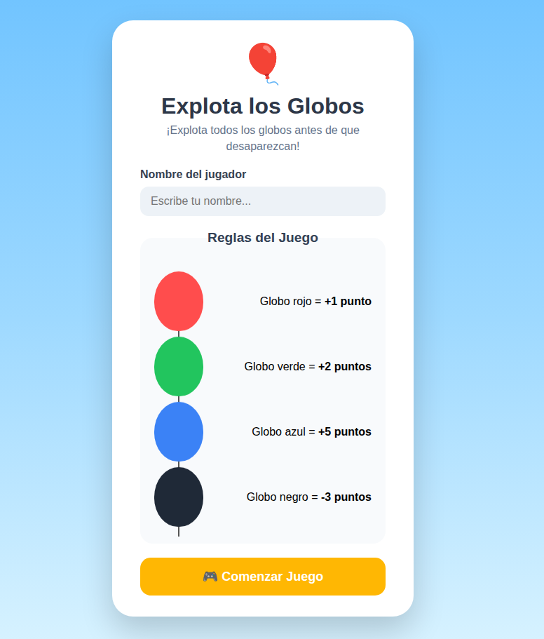
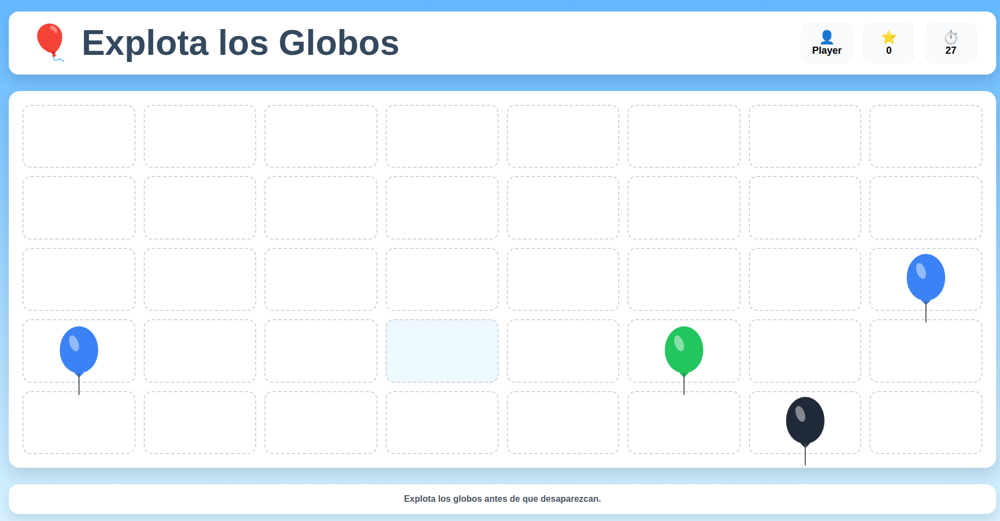
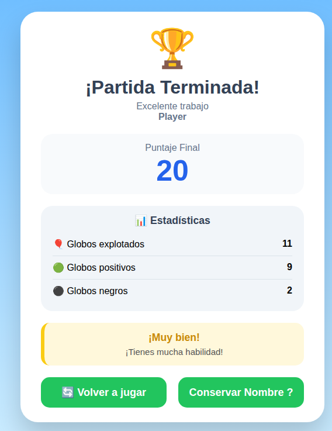

# 🎈 Explota los Globos

## 👨‍💻 Estudiante
**Esteban Mente**

---

# 📖 Descripción del juego

**Explota los Globos** es un juego desarrollado con **React** donde el jugador debe explotar la mayor cantidad posible de globos para obtener la puntuación más alta.

Cada globo tiene un valor diferente:

| Globo | Puntos |
|-------|---------|
| 🔴 Rojo | +1 |
| 🟢 Verde | +2 |
| 🔵 Azul | +5 |
| ⚫ Negro | -3 |

Al finalizar la partida se muestra una pantalla con:

- Puntaje final.
- Cantidad total de globos explotados.
- Globos positivos explotados.
- Globos negros explotados.
- Un mensaje personalizado según el puntaje obtenido.

Además, el jugador puede volver a jugar o conservar su nombre para iniciar una nueva partida.

---

# 🌐 Demo del proyecto

Puedes acceder al juego desde el siguiente enlace:

🔗 **https://esteban985.github.io/Explotar_Globos_React/**

---

# 🖼️ Capturas de pantalla

## 🏠 Pantalla de Inicio

<p align="center">
  
</p>

---

## 🎮 Pantalla del Juego

<p align="center">
  
</p>

---

## 🏆 Pantalla Final

<p align="center">
  
</p>

---

# 🚀 Instrucciones para ejecutar el proyecto

## 1. Clonar el repositorio

```bash
git clone URL_DEL_REPOSITORIO
```

## 2. Entrar a la carpeta

```bash
cd nombre-del-proyecto
```

## 3. Instalar las dependencias

```bash
npm install
```

## 4. Ejecutar el proyecto

```bash
npm run dev
```

## 5. Abrir en el navegador

Generalmente Vite abrirá el proyecto en:

```
http://localhost:5173
```

---

# ⚛️ Conceptos de React utilizados

Durante el desarrollo del proyecto se utilizaron varios conceptos fundamentales de React:

- Componentes funcionales.
- JSX para construir la interfaz.
- Props para comunicar componentes.
- Hooks:
  - `useContext`
- Renderizado condicional.
- Eventos (`onClick`, `onSubmit`).
- Manejo de formularios.
- Estado global mediante Context API.
- Organización del proyecto por componentes.

---

# 🌐 Uso de Context API

Para evitar pasar información entre muchos componentes mediante props, se utilizó **Context API**.

Se creó un **JuegoProvider** que almacena toda la información importante del juego, como por ejemplo:

- Nombre del jugador.
- Puntaje.
- Pantalla actual.
- Cantidad de globos explotados.
- Globos positivos.
- Globos negros.
- Funciones para reiniciar el juego.
- Funciones para conservar el nombre del jugador.

Gracias a Context API, cualquier componente puede acceder a esta información utilizando `useContext`, haciendo que el código sea más limpio, organizado y fácil de mantener.

---

# ⚠️ Dificultad principal encontrada

La principal dificultad durante el desarrollo fue lograr que los globos aparecieran en pantalla de forma individual y continua, en lugar de renderizar todos los globos al mismo tiempo.

Inicialmente, al generar los globos desde un arreglo, todos se mostraban de una sola vez, lo que no representaba la mecánica deseada del juego. El objetivo era que los globos fueran apareciendo uno por uno cada cierto tiempo, simulando un flujo constante y manteniendo un límite de globos visibles en pantalla.

---

# ✅ ¿Cómo se resolvió esa dificultad?

La solución consistió en iniciar el estado del juego con un único globo predeterminado y utilizar un temporizador para agregar un nuevo globo cada segundo.

Cada vez que transcurre un segundo, se crea un nuevo globo con un color aleatorio y se agrega al final del arreglo. Para evitar que la pantalla se llene de globos, se estableció un límite máximo de cinco globos visibles. Cuando el arreglo ya contiene cinco elementos, se elimina automáticamente el primer globo (el más antiguo) y se agrega el nuevo al final.

De esta manera, React vuelve a renderizar únicamente los cambios del estado, dando la sensación de que los globos aparecen uno por uno de forma continua. Esta estrategia permitió mantener un flujo constante de globos, mejorar el rendimiento de la aplicación y ofrecer una experiencia de juego más dinámica y fluida.

---

# 🛠️ Tecnologías utilizadas

- React
- Vite
- JavaScript (ES6+)
- JSX
- CSS3
- HTML5

---

# 📂 Estructura general del proyecto

```
src/
│
├── Components/
├── JuegoContext/
├── App.jsx
├── main.jsx
│
└── assets/
```

---

# 🎯 Objetivo del proyecto

El propósito de este proyecto fue poner en práctica los conocimientos adquiridos sobre React, especialmente el uso de componentes, eventos, renderizado condicional y el manejo del estado global mediante Context API para desarrollar un juego interactivo con una interfaz amigable y dinámica.